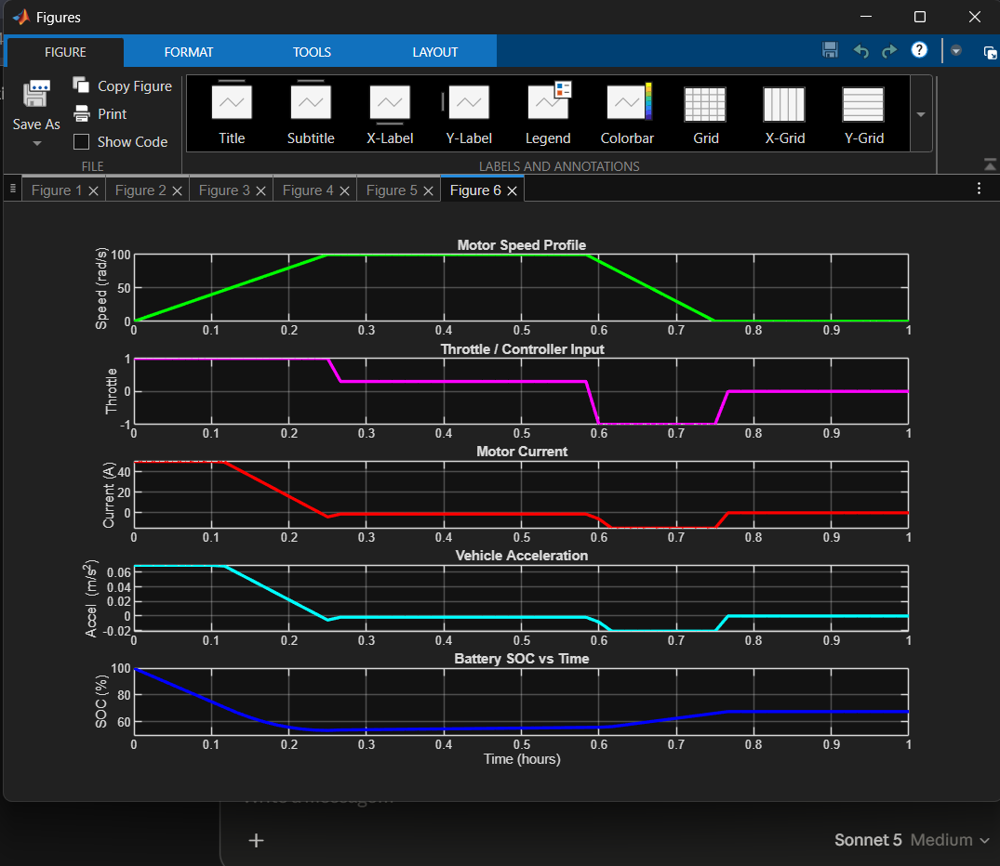
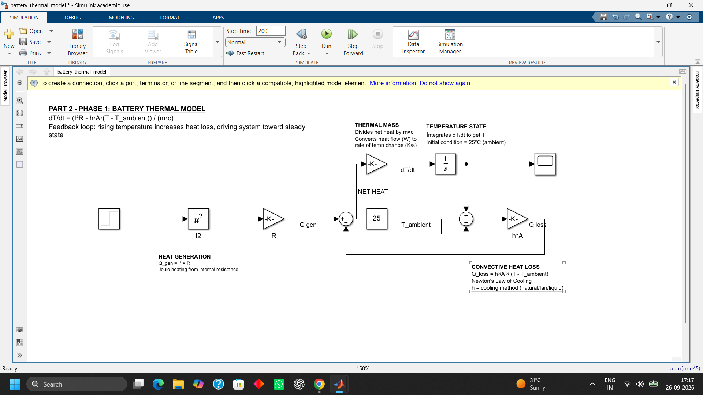
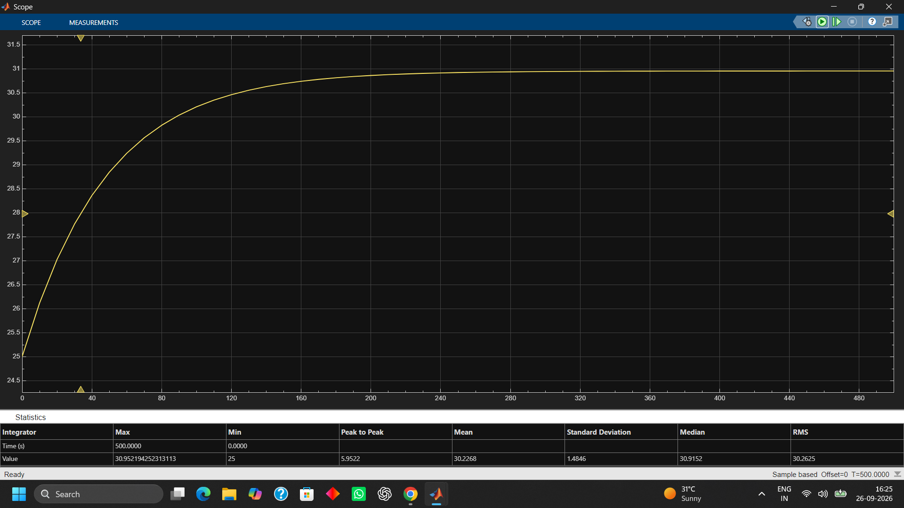
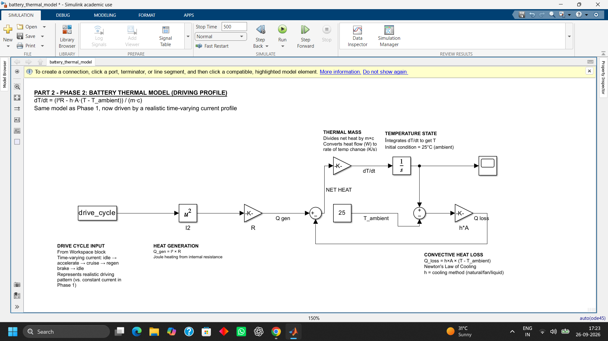
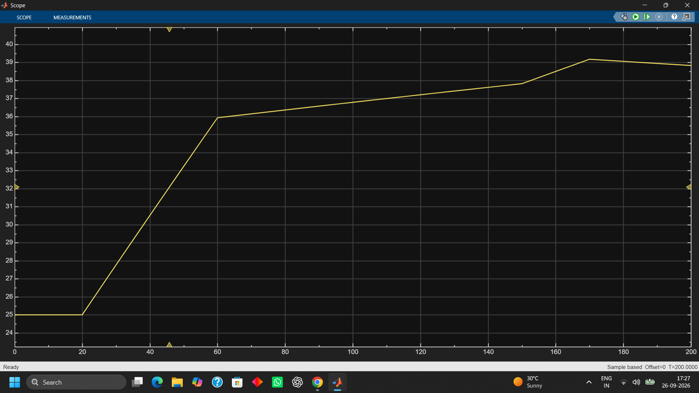
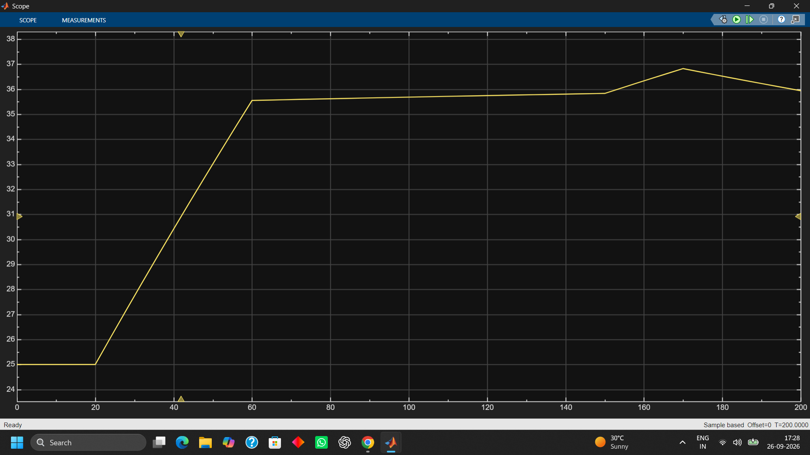
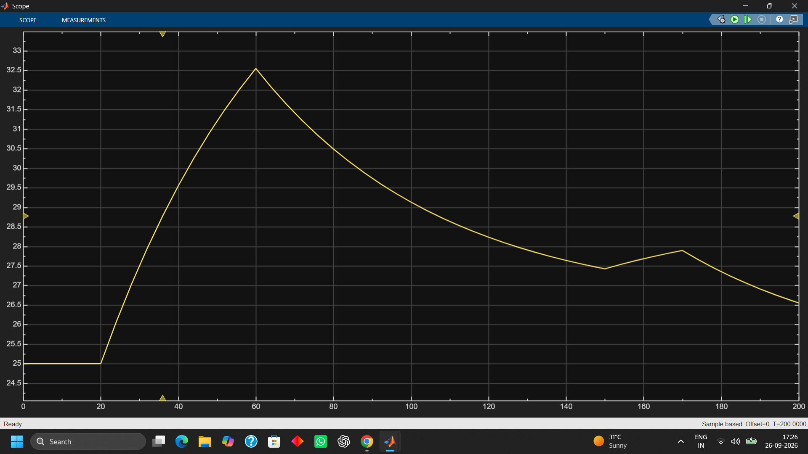

# EV Powertrain Simulator

A simulation of an electric vehicle's core systems — battery, motor, controller, and signal processing — built from first principles in **MATLAB** and **Simulink**.

This project was built to deeply understand how the pieces of an EV powertrain interact, not just to produce a working script. Every phase started from the governing physical equation, was implemented, run, and then debugged using physical reasoning whenever the output looked wrong.


## What it simulates

- **Battery State of Charge (SOC)** using Coulomb counting
- **A driving cycle** (accelerate → cruise → brake → idle) with **regenerative braking**
- **Motor electrical behaviour** — back-EMF, Ohm's law, torque — driving current directly from vehicle speed and throttle input
- **Vehicle dynamics** — torque → force → acceleration via Newton's second law
- **Realistic sensor noise and signal processing** — FFT frequency analysis and a moving-average filter to recover a clean signal from a noisy one

It was built twice: once as MATLAB code (4 phases) and once as an equivalent Simulink block diagram (3 phases), to understand the same physics two different ways.

## Results

**MATLAB — full signal chain (throttle → current → acceleration → SOC)**


**MATLAB — signal processing: recovering a clean current signal from a noisy sensor reading**


**Simulink — same physics, block-diagram implementation, matching SOC result**


## Project structure

```
EV_Powertrain_Simulator/
├── matlab/
│   ├── battery_soc_model.m      # Phase 1: Battery SOC (Coulomb counting)
│   ├── battery_soc_phase2.m     # Phase 2: Driving profile + regen braking
│   ├── battery_soc_phase3.m     # Phase 3: Motor model + throttle + vehicle dynamics
│   └── battery_soc_phase4.m     # Phase 4: Sensor noise, FFT, filtering
├── Simulink/
│   ├── ev_phase1.slx            # Battery SOC block model
│   ├── ev_phase2.slx            # Driving profile with Signal Editor
│   ├── ev_phase3.slx            # Motor model in blocks (annotated)
│   ├── driving_profile.mat
│   ├── omega_profile.mat
│   └── throttle_profile.mat
├── images/                      # Result screenshots used in this README
└── EV_Powertrain_Simulator_Notes.pdf   # Full concept + formula + debugging reference
```

## Core equations

**Battery SOC (Coulomb counting)**
```
SOC(t) = SOC0 - (100/Q) x ∫ I dt
```

**Motor current (Ohm's law with back-EMF)**
```
I_raw = (V - Ke x ω) / R
I_load = throttle x I_raw
```

**Vehicle dynamics**
```
F = T / r_wheel        (T = Kt x I)
a = F / m
```

**Moving average filter (FIR)**
```
y[n] = (1/M) x Σ x[n-k],  for k = 0..M-1
```

Full formula sheet, parameter values, and every design decision explained in [`EV_Powertrain_Simulator_Notes.pdf`](EV_Powertrain_Simulator_Notes.pdf).

## Key engineering decisions and debugging stories

- **Asymmetric charge/discharge current limits** — real batteries accept charge much more slowly than they release it, so discharge is capped at 50A while charging/regen is capped at 15A.
- **Battery capacity scaled to 20Ah** — the original 2Ah battery was too small relative to real motor currents (up to 96A at stall); a 15A regen current over 10 minutes alone would have exceeded the entire pack, causing unrealistic instant saturation. Traced with hand-calculated Ah numbers before changing anything.
- **Throttle/controller layer added** — raw motor physics with no controller implied ~96A of "phantom current" even while the car was parked (idle). A throttle signal representing driver intent (-1 to 1) fixes this by scaling current to zero when the pedal isn't pressed.
- **Units mismatch in Simulink** — a gain calculated for an "hours" time base silently broke when the model switched to a "seconds" time base, causing SOC to crash 3600x faster than expected. Same class of bug as keeping `dt` in hours to match Amp-hours back in the MATLAB version.
- **Block order matters, not just block values** — a correctly-configured Saturation block did nothing because it was placed *after* the signal had already been scaled down to a tiny SOC-rate number instead of clamping the raw current itself.

## Tools used

MATLAB, Simulink (Signal Editor, Integrator, Saturation, Product, Sum, Gain blocks), Coulomb counting, FFT / DTFT-based signal analysis, FIR filtering.

## Author

Piyush — built as a self-directed project alongside coursework in Digital Signal Processing, with an interest in the EV industry.

## Part 2: Battery Thermal Model

Part 1 answered how much charge a battery has left and how the motor responds to throttle. Part 2 asks a different question: what happens to the battery's *temperature* while all of that is happening — and whether it stays safe.

Like every phase before it, this started from the governing physical equation rather than a canned block:


Heat generated by current flowing through internal resistance, minus heat lost to the surroundings via convection, determines how fast the battery's temperature changes. Unlike the SOC integrator in Phase 1, this is a **closed feedback loop** — the hotter the battery gets, the faster it loses heat, which is what drives the system toward a stable temperature instead of climbing forever.

### Model parameters (reference 18650 Li-ion cell)

| Parameter | Value |
|---|---|
| Internal resistance | 0.05 Ω |
| Cell mass | 0.045 kg |
| Specific heat capacity | 900 J/kg·K |
| Surface area | 0.0042 m² |
| Ambient temperature | 25°C |

### Phase 4a — Steady-current validation

A constant 10A current was applied to validate the model against hand-calculated predictions before testing anything more complex.





With liquid cooling, temperature settled at ~31°C — matching the hand-calculated prediction of 31.0°C almost exactly, confirming the model's correctness.

### Phase 4b — Realistic drive-cycle response

The same model was then driven by a realistic current profile (idle → accelerate → cruise → regenerative brake → idle) instead of a constant current:

| Phase | Time (s) | Current (A) |
|---|---|---|
| Idle | 0–20 | 0 |
| Accelerate | 20–60 | 15 |
| Cruise | 60–150 | 5 |
| Regen brake | 150–170 | −8 |
| Idle | 170–200 | 0 |



### Results: three cooling strategies compared

| Cooling | Steady-state temp (10A constant) | Drive-cycle peak temp |
|---|---|---|
| None (natural convection) | 173.8°C | ~39.3°C |
| Fan (forced air) | ~72.6°C | ~36.8°C |
| Liquid cooling | ~31.0°C | ~32.5°C |








Only liquid cooling kept the cell in a safe range under both test conditions. This wasn't assumed going in — it fell out of the model itself, and it's the same conclusion every real EV manufacturer has reached: natural or fan cooling alone isn't enough once you're pulling real current. The drive-cycle test also revealed that regenerative braking still generates measurable heat, since heat generation depends on current *magnitude* (I²), not direction.

### Files

- `Simulinks/battery_thermal_model.slx` — steady-current model
- `Simulinks/battery_thermal_model_phase2.slx` — drive-cycle model
- `matlab/drive_cycle_setup.m` — drive cycle definition script

## Project Structure

```
EV-Powertrain-Simulator/
├── Simulinks/
│   ├── ev_phase1.slx                        # Phase 1: SOC model
│   ├── ev_phase2.slx                        # Phase 2: Driving profile
│   ├── ev_phase3.slx                        # Phase 3: Motor electrical model
│   ├── battery_thermal_model.slx            # Phase 4: Thermal model (steady-current)
│   └── battery_thermal_model_phase2.slx     # Phase 4: Thermal model (drive-cycle)
├── matlab/
│   ├── speed_profile.mat
│   ├── throttle_profile.mat
│   ├── driving_profile.mat
│   └── drive_cycle_setup.m                  # Phase 4 drive cycle definition
├── images/                                  # Result screenshots, numbered by phase
├── EV_Powertrain_Simulator_Notes.pdf
└── README.md
```
